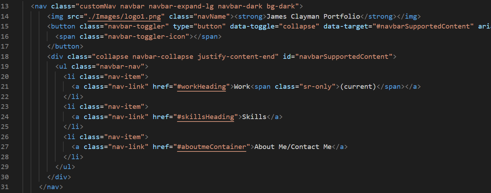
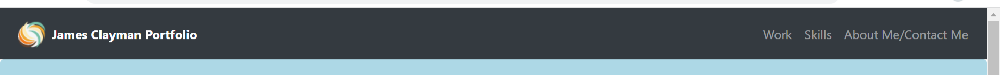
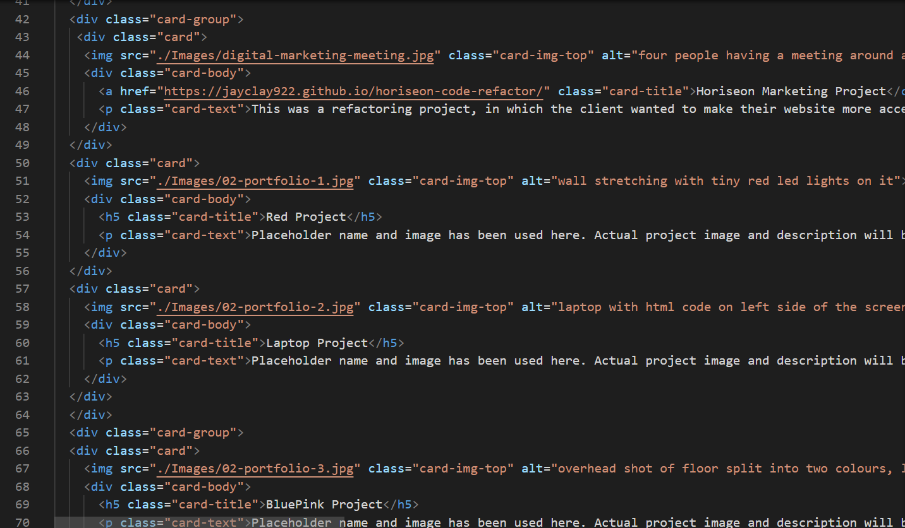
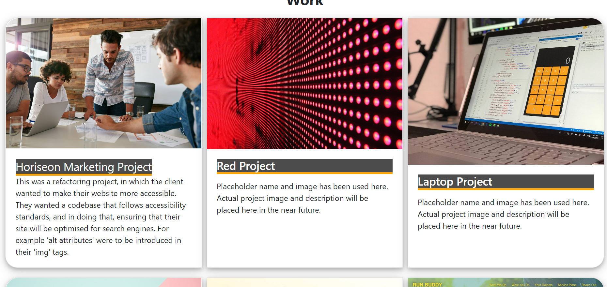
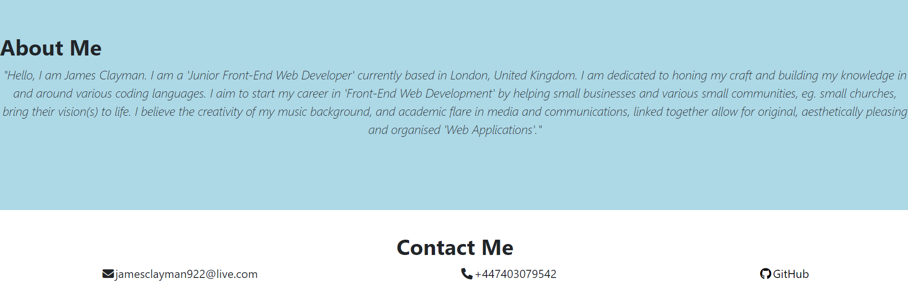

# Bootstrap-Portfolio

## Project
This project required building my portfolio, again. However, this time building the layout using the 'Bootstrap CSS Framework' from scratch.

## Accceptable Criteria
The acceptance criteria for this project are, that using Bootstrap we have to recreate our site with the following items:-

1. A 'Navigation Bar', with the 'Navigation Menu' at the top
2. The 'Navigation Menu' should have working links that are applicable to my portfolio.
3. As mentioned above the links should navigate to the appropriate sections.
4. A 'Hero Section', using a jumbotron from 'Bootstrap' featuring my picture,my name, and any other information I'd like to include.
5. A 'Work Section' displaying my work in grid. Using 'Bootstrap Card' to display our work using placeholder image and name if needed. With an image of our work and a short description.
6. A 'Skills Section' detailing the skills we expect to gain from this bootcamp
7. Lastly, an, 'About me/Contact me' section, detailing a few things about me, and where and how to contact me.

## Outcome
Though this project was fairly easier with the help of 'Bootstrap CSS', it still came with it' challenges. However I did manage to arrive at a suitable outcome.

- I successfully used the 'Bootstrap CSS Framework' for the 'Navigation Bar' and menu, with different section headings such as 'Work', 'Skills' etc...
 
 

 

- I was able to add a jumbotron with my name, my picture and some extra information.
- I included my work in the 'Work Section' using 'Bootstrap Card Decks'. The first card has a refactoring project I did with an image and a short description. The rest of the cards have placeholder names and images.

   
 

- I included a 'Skills Section' detailing skills I hope to gain within the bootcamp.
- Lastly, I added the About me and Contact me section within the footer. However, per the instructions, they were meant to be on the same row. I had some difficulty here and opted to place one above the other as seen in the final screenshots:

 

 ## License
 Copyright (c) 2022 JayClay922

Permission is hereby granted, free of charge, to any person obtaining a copy of this software and associated documentation files (the "Software"), to deal in the Software without restriction, including without limitation the rights to use, copy, modify, merge, publish, distribute, sublicense, and/or sell copies of the Software, and to permit persons to whom the Software is furnished to do so, subject to the following conditions:

The above copyright notice and this permission notice shall be included in all copies or substantial portions of the Software.

THE SOFTWARE IS PROVIDED "AS IS", WITHOUT WARRANTY OF ANY KIND, EXPRESS OR IMPLIED, INCLUDING BUT NOT LIMITED TO THE WARRANTIES OF MERCHANTABILITY, FITNESS FOR A PARTICULAR PURPOSE AND NONINFRINGEMENT. IN NO EVENT SHALL THE AUTHORS OR COPYRIGHT HOLDERS BE LIABLE FOR ANY CLAIM, DAMAGES OR OTHER LIABILITY, WHETHER IN AN ACTION OF CONTRACT, TORT OR OTHERWISE, ARISING FROM, OUT OF OR IN CONNECTION WITH THE SOFTWARE OR THE USE OR OTHER DEALINGS IN THE SOFTWARE.